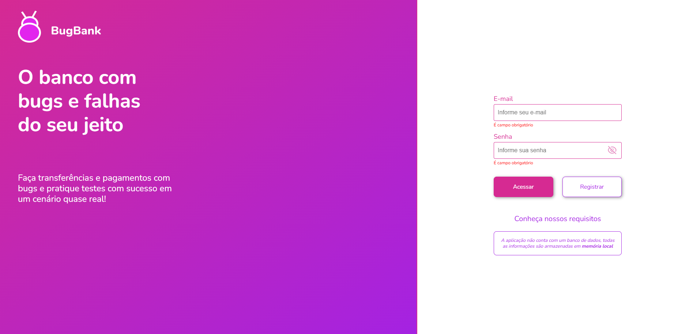

# Projeto de Testes do Sistema BugBank

Este repositório documenta o conjunto de testes realizados no sistema **BugBank**, uma plataforma de demonstração para operações bancárias simuladas. O objetivo principal foi garantir que as funcionalidades de registro de usuário, login e operações bancárias, como transferências e consultas de saldo, funcionassem conforme o esperado.

## Detalhes do Teste

### Testes de Registro de Usuário

- **Registro com Dados Válidos:** Realizei testes no formulário de registro com dados válidos, verificando que o sistema criava a conta com sucesso.
- **Registro com Valor na conta:** Testei a criação de conta com a opção de valor na conta, assegurando que o sistema completava o registro sem erros.

### Testes de Login e Operações Bancárias

- **Login com Credenciais Corretas e Incorretas:** Validei o acesso ao sistema com combinações corretas e incorretas de usuário e senha, para garantir mensagens de erro apropriadas em tentativas falhas.
- **Transferência de Fundos:** Testei a transferência entre contas para verificar se o sistema atualizava corretamente os saldos das contas envolvidas.
- **Consulta de Saldo:** Realizei consultas de saldo para garantir que os valores exibidos estavam corretos após depósitos, retiradas e transferências.

### Exemplo de Casos de Teste

- **Registro de Novo Usuário com Sucesso:** O sistema cria a conta corretamente quando todos os dados são válidos.
- **Falha no Registro com Campos Vazios:** Quando campos obrigatórios são deixados em branco, o sistema exibe uma mensagem de erro e não permite o registro.
- **Transferência Bem-Sucedida entre Contas:** O sistema atualiza os saldos de remetente e destinatário após uma transferência bem-sucedida.

## Conclusão

Este projeto de testes do sistema **BugBank** assegura que as principais funcionalidades bancárias e de segurança funcionem de maneira confiável, proporcionando uma experiência de usuário robusta e aderente aos padrões de qualidade esperados.
